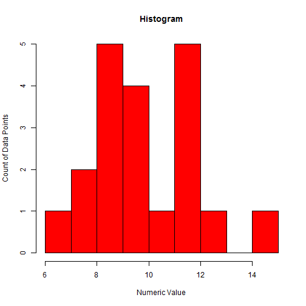

## Application Overview

Sometimes, it is helpful to be able to generate a visual representation of a normal distribution using a set of chosen inputs.  This application allows the user to provide a set of inputs and then generates a chart illustrating how a set of normally distributed data would appear using that information.

--- .class #id 

## Application Inputs

The application takes in three inputs:

1. The number of data points
2. The mean value of the points in the distribution
3. The standard deviation of the points in the distribution

The N must be between 1 and 1000, while the mean and standard deviation must be between 0 and 1000.


```r
        numericInput('id_n','Number of Data Points',
                     1,min=1,max=1000,step=1),
        numericInput('id_mean','Mean Value',
                     0,min=0,max=1000,step=1),
        numericInput('id_sd','Standard Deviation',
                     0,min=0,max=1000,step=1)
```

--- .class #id 

## Application Calculations

Once the data is entered, a set of normally distributed data is generated using the `rnorm` function as follows:


```r
my_data <- reactive(rnorm(n=input$id_n,mean=input$id_mean,sd=input$id_sd))
```

For example, if we use `n = 20`, with a mean of `10` and a standard deviation of `2` then the data generated is as follows:


```
##  [1]  8.202433 14.364076 10.628088  8.423842 11.803378 11.199938 11.675779
##  [8]  8.064000  7.739767  9.009938  7.008986  8.511917  9.407992  9.626183
## [15]  8.917613 12.519398  6.386854 11.085297 11.292989  9.060071
```

--- .class #id 

## Application Output

Finally, the app outputs a histogram of the data using the following server code:

```r
hist(my_data(),xlab='Numeric Value',ylab='Count of Data Points',col='red',main='Histogram')
```



